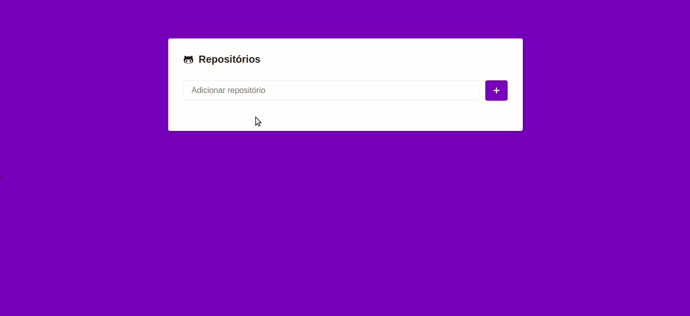

# GoStack Challenge 05
> Objective: Create a simple application using ReactJS (with Styled Components) using the GitHub API to save a list of repositories and their respectives issues. [See full requirements](https://github.com/Rocketseat/bootcamp-gostack-desafio-05)

Used tools:
- ReactJS;
- Webpack;
- Babel;
- Webpack Dev Server;
- Styled Components;
- GitHub API;

## Application
This application is a simple project that use the GitHub API to save repositories to a list, with the option to show details like issues, image and description.

